# Azure Load Balancer Lab (AZ-104)

## Overview

This project demonstrates the deployment and configuration of an Azure Public Load Balancer to distribute incoming HTTP traffic across multiple Windows Server virtual machines. The lab showcases high availability, traffic distribution, health monitoring, and network security concepts commonly used in enterprise Azure environments.

The solution was implemented using Microsoft Azure services and aligns with networking, compute, and availability objectives covered in the Microsoft Azure Administrator Associate (AZ-104) certification.

---

# Architecture Diagram

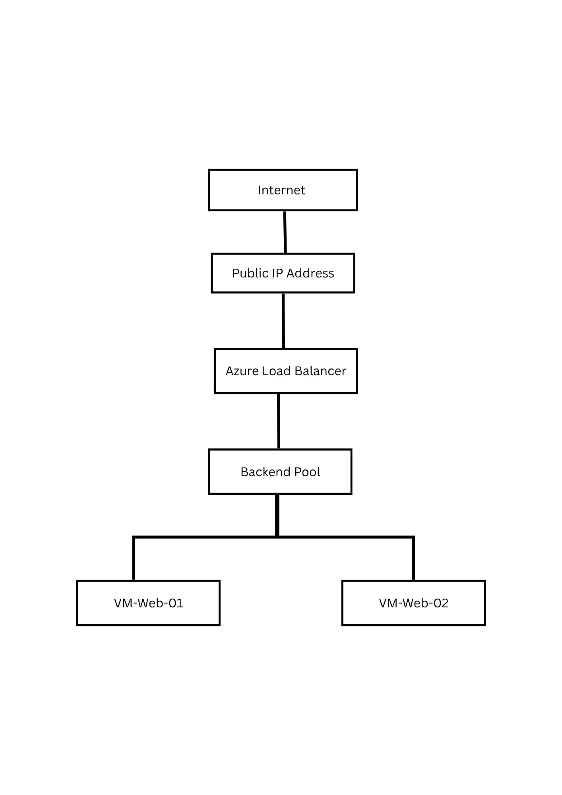

## Architecture Components

| Component              | Purpose                                                      |
| ---------------------- | ------------------------------------------------------------ |
| Azure Load Balancer    | Distributes incoming traffic across backend virtual machines |
| Public IP Address      | Internet-facing endpoint for client access                   |
| Backend Pool           | Group of virtual machines receiving traffic                  |
| Health Probe           | Monitors VM availability and health                          |
| Virtual Network        | Provides network connectivity                                |
| Subnet                 | Hosts the virtual machines                                   |
| Network Security Group | Controls inbound and outbound traffic                        |
| VM-Web-01              | Backend web server                                           |
| VM-Web-02              | Backend web server                                           |
| IIS                    | Hosts test web application                                   |

---

# Objectives

* Deploy a Virtual Network and Subnet
* Deploy multiple Windows Server virtual machines
* Install and configure IIS Web Server
* Create an Azure Public Load Balancer
* Configure Backend Pools
* Configure Health Probes
* Configure Load Balancing Rules
* Secure traffic using Network Security Groups
* Validate traffic distribution and high availability

---

# Environment

| Resource        | Name                   |
| --------------- | ---------------------- |
| Resource Group  | rg-az104-load-balancer |
| Virtual Network | vnet-lb-lab            |
| Subnet          | web-subnet             |
| Load Balancer   | lb-web-public          |
| Virtual Machine | vm-web-01              |
| Virtual Machine | vm-web-02              |
| Public IP       | pip-load-balancer      |

---

# Step 1 - Create Resource Group

Created a dedicated resource group to contain all resources used throughout the lab.

### Screenshot

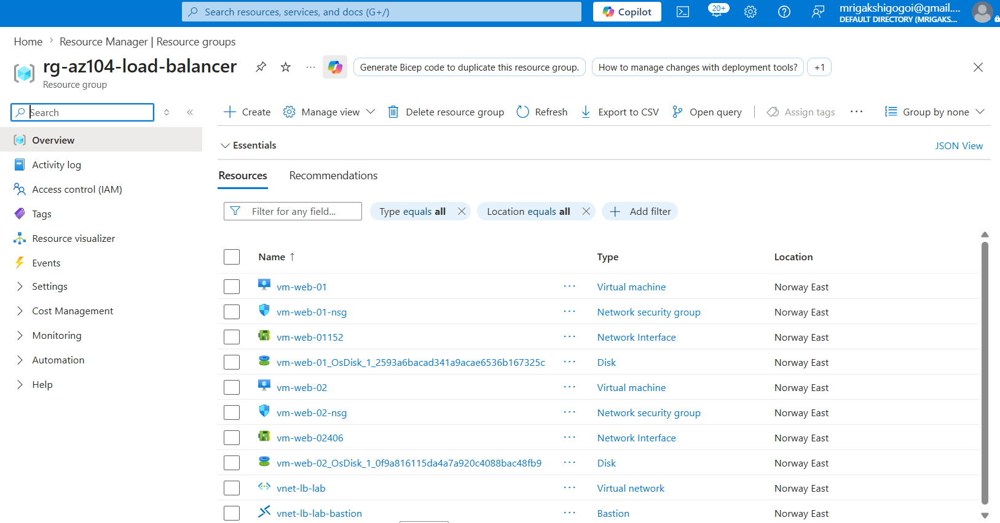

---

# Step 2 - Create Virtual Network

Created a Virtual Network and subnet to host the backend virtual machines.

### Configuration

| Setting       | Value       |
| ------------- | ----------- |
| Address Space | 10.1.0.0/16 |
| Subnet        | web-subnet  |
| Subnet Range  | 10.1.1.0/24 |

### Screenshot

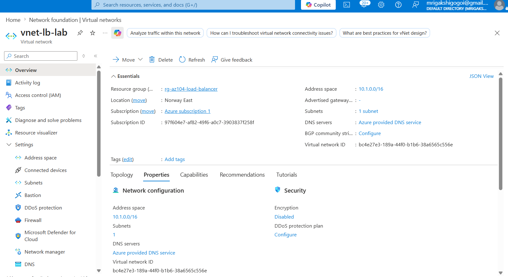

---

# Step 3 - Deploy Virtual Machines

Deployed two Windows Server 2022 virtual machines that will serve as backend web servers.

### Virtual Machines

| VM Name   |
| --------- |
| vm-web-01 |
| vm-web-02 |

### Screenshot

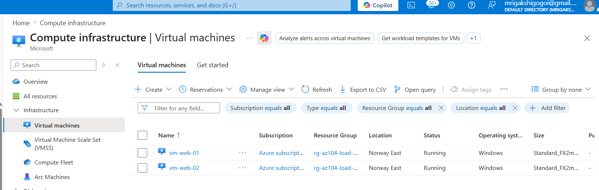

---

# Step 4 - Install IIS

Installed Internet Information Services (IIS) on both virtual machines.

Configured custom landing pages to identify which server responded to the request.

### Example

VM-Web-01 displays:

```html
<h1>Server 1</h1>
```

VM-Web-02 displays:

```html
<h1>Server 2</h1>
```

### Screenshot

VM-Web-01:

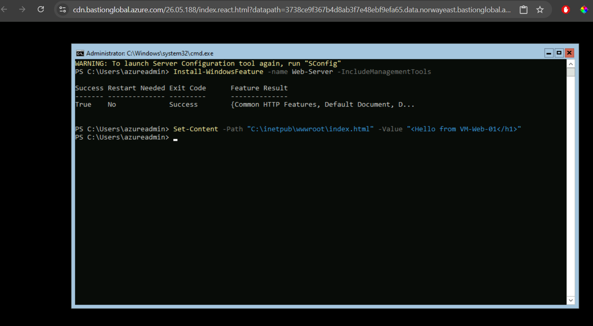
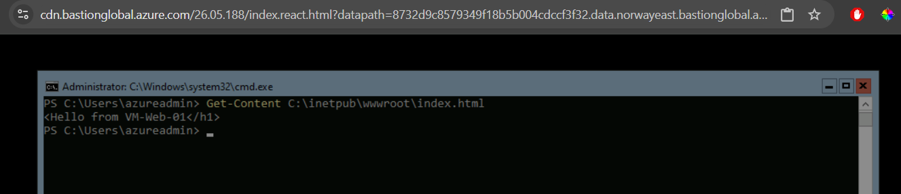


VM-Web-02:

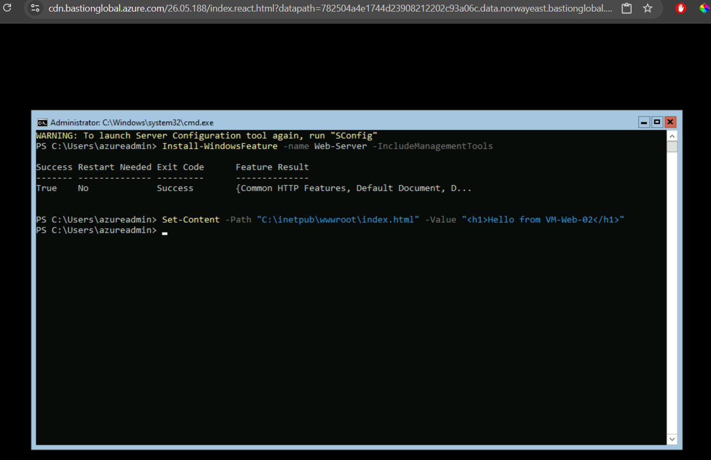
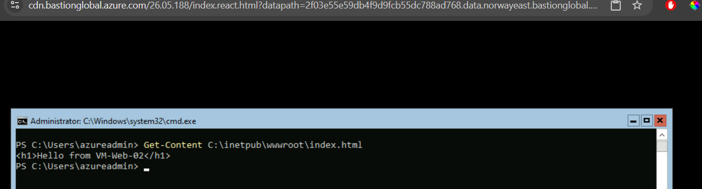


---

# Step 5 - Create Azure Load Balancer

Created a Public Load Balancer with a dedicated Public IP address.

### Configuration

| Setting     | Value             |
| ----------- | ----------------- |
| SKU         | Standard          |
| Type        | Public            |
| Frontend IP | Public IP Address |

### Screenshot

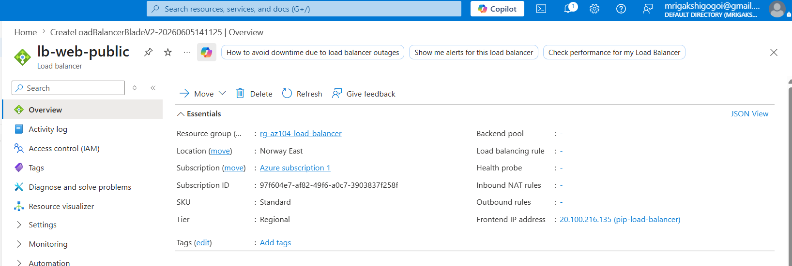

---

# Step 6 - Configure Backend Pool

Added both virtual machines to the Load Balancer backend pool.

### Backend Pool Members

* vm-web-01
* vm-web-02

### Screenshot

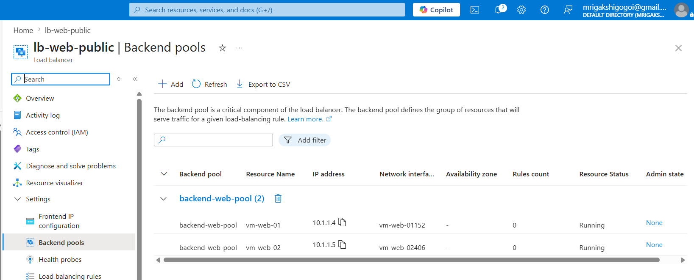

---

# Step 7 - Configure Health Probe

Created a health probe to continuously monitor the status of backend virtual machines.

### Configuration

| Setting  | Value |
| -------- | ----- |
| Protocol | TCP   |
| Port     | 80    |

### Screenshot

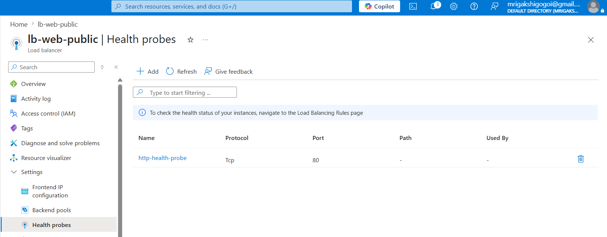

---

# Step 8 - Configure Load Balancing Rule

Configured a Load Balancing Rule to distribute HTTP traffic to healthy backend servers.

### Configuration

| Setting       | Value       |
| ------------- | ----------- |
| Frontend Port | 80          |
| Backend Port  | 80          |
| Protocol      | TCP         |
| Backend Pool  | Web Servers |

### Screenshot

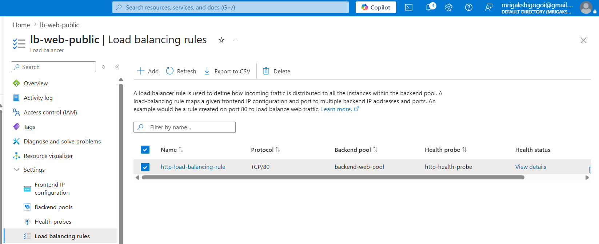

---

# Step 9 - Configure Network Security Group

Created an inbound security rule to allow HTTP traffic.

### Rule

| Setting  | Value |
| -------- | ----- |
| Protocol | TCP   |
| Port     | 80    |
| Action   | Allow |

### Screenshot

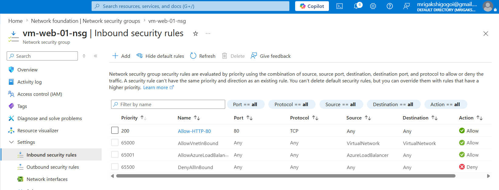

---

# Step 10 - Validate Load Balancing

Accessed the Load Balancer Public IP address from a web browser.

Verified that traffic was distributed across backend servers.

### Validation

* Server 1 response observed
* Server 2 response observed
* Health probe reported healthy instances
* Load Balancer distributed requests successfully

### Screenshot

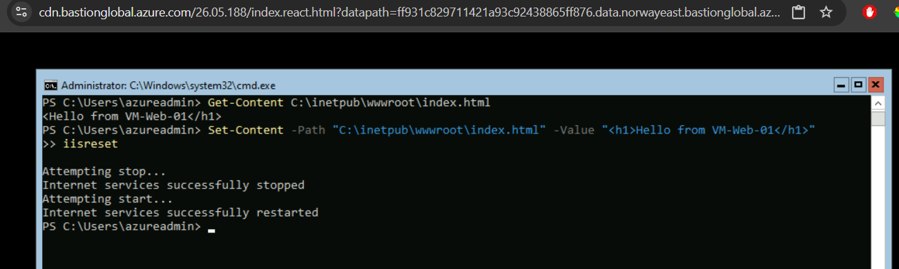
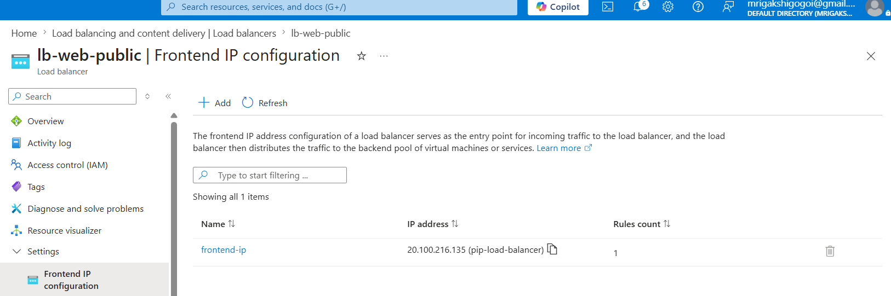
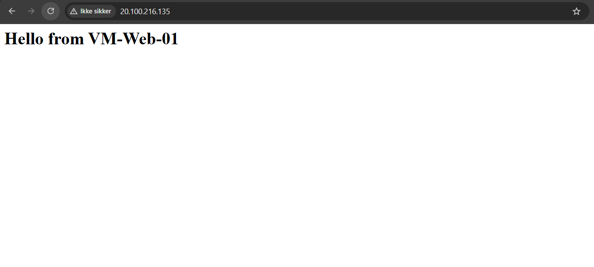

After several refreshing
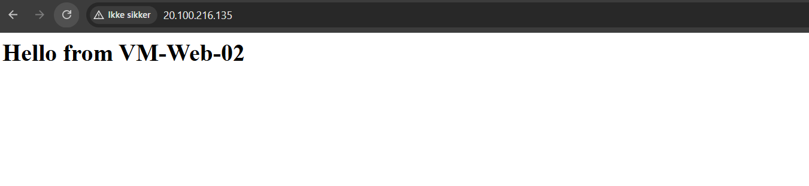


---

## Step 11 - Validate Backend Health

Verified that both backend virtual machines were successfully added to the Load Balancer backend pool and monitored through the configured health probe.

The Azure Load Balancer continuously checks the availability of each backend server using the configured TCP health probe on port 80 and only routes traffic to healthy instances.

### Validation

* Backend Pool configured successfully
* Health Probe status healthy
* Load Balancer distributed traffic to available backend servers
* IIS web application accessible through the Load Balancer public IP

### Screenshot

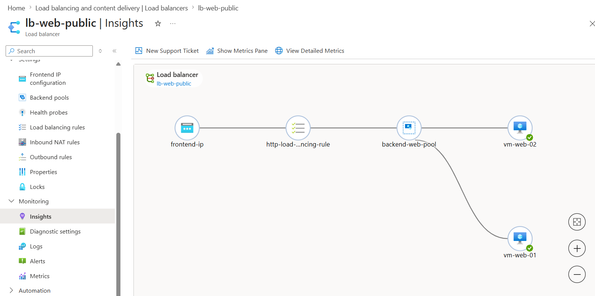


# Key Learning Outcomes

* Azure Load Balancer deployment
* Backend Pool configuration
* Health Probe configuration
* Load Balancing Rules
* Azure Virtual Machines
* Virtual Networking
* Network Security Groups
* High Availability Architecture
* Traffic Distribution
* Azure Infrastructure Administration

---

# Skills Demonstrated

* Microsoft Azure
* Azure Administration
* Azure Networking
* Azure Load Balancer
* Azure Virtual Machines
* Azure Virtual Networks
* Network Security Groups
* High Availability
* Infrastructure as a Service (IaaS)
* Cloud Infrastructure Management
* Microsoft AZ-104

---

# Repository Structure

```text
azure-load-balancer-lab/
│
├── README.md
│
├── architecture
│   └── architecture-diagram.png
│
└── screenshots
    ├── 01-architecture-diagram.png
    ├── 02-resource-group.png
    ├── 03-virtual-network.png
    ├── 04-virtual-machines.png
    ├── 05-iis-installation.png
    ├── 06-load-balancer-overview.png
    ├── 07-backend-pool.png
    ├── 08-health-probe.png
    ├── 09-load-balancing-rule.png
    ├── 10-nsg-http-rule.png
    └── 11-load-balancer-validation.png
```

## Conclusion

This lab demonstrates how Azure Load Balancer can be used to distribute traffic across multiple virtual machines, improve application availability, and provide a scalable foundation for cloud-hosted workloads. The implementation follows Azure networking and high-availability best practices commonly used in enterprise environments.
